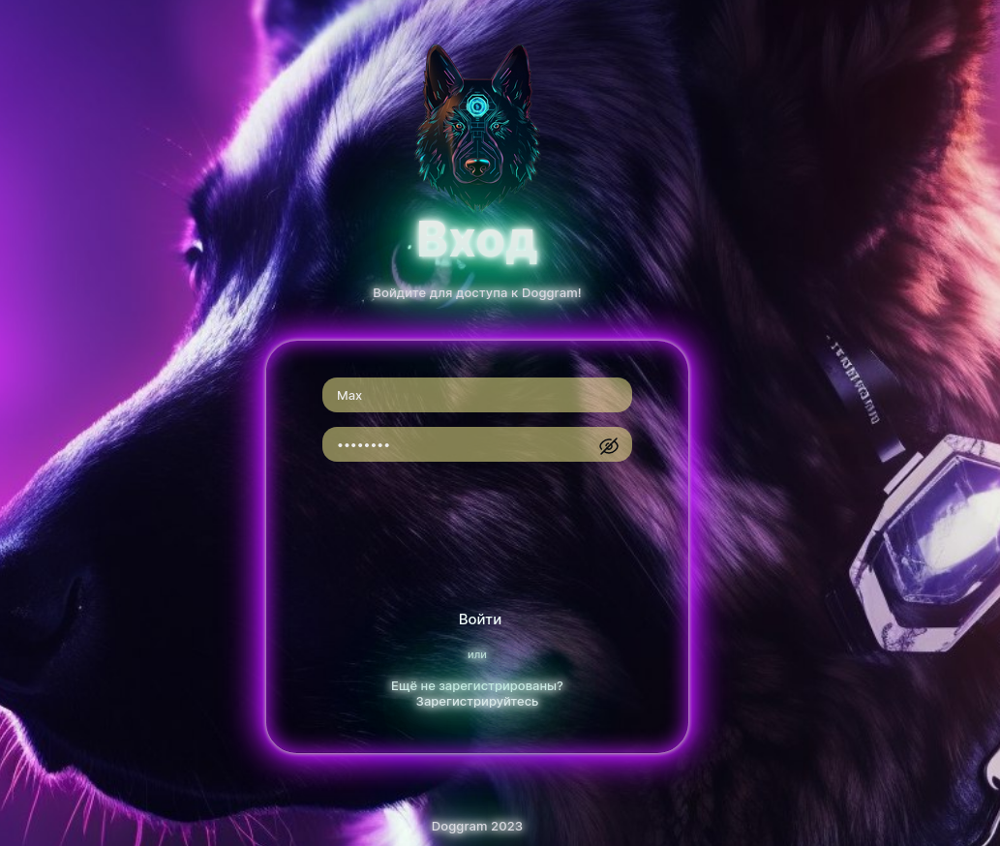

# doggram

- ## Описание
    это API приложение для любителей собак, где пользователи могут выкладывать фотографии своих питомцев и делиться их достижениями с другими участниками. 

- ## Установка
- DOG_BACK
    > Склонировать репозиторий
  > 
    > Создать и активировать venv    
        ` python -m venv venv `\
        ` source venv/script/activate `
  > 
  > Через терминал заходим в папку dog_back
        `cd\dog_back`
  > 
    > Установка зависимости\
        ` pip install -r requirements.txt `
  > 
   > Через терминал заходим в папку doggram
        `cd\dog_back\doggram`
  > 
    > Сделать миграции\
       `python manage.py makemigrations`\
       `python manage.py migrate`
    > 
    > Запуск\
        ` python manage.py runserver`

- DOG_FRONT
    > Установить npm
  >
  > Через терминал заходим в папку dog_frontend
        `cd\dog_frontend`
  > 
    > Установка зависимости\
        ` npm i `
  > 
   > Запуск проекта 
        `npm run start`
- Итог
